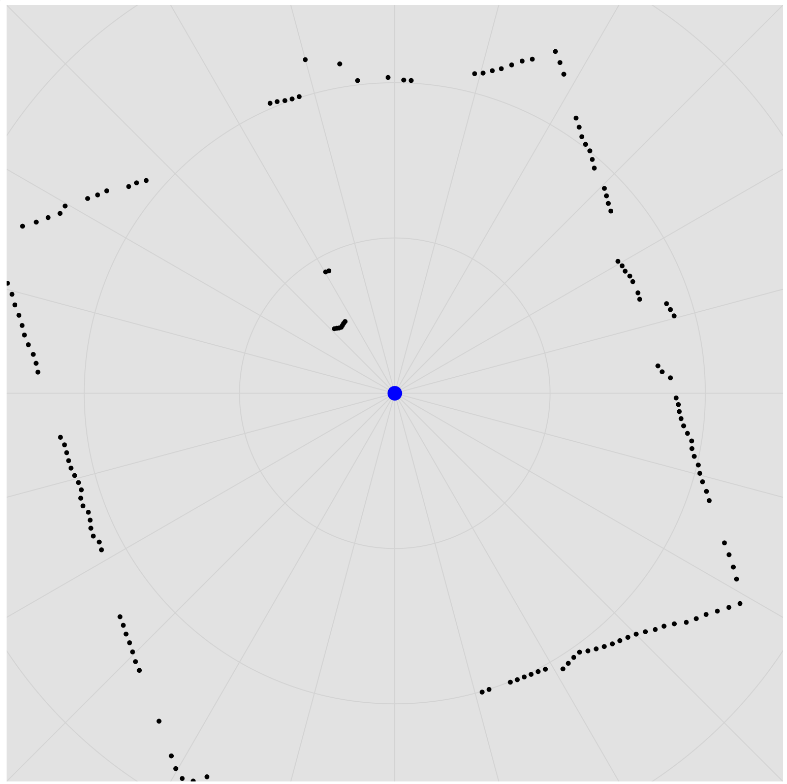

# RPLidar


[](https://hex.pm/packages/rplidar)
[](https://hexdocs.pm/rplidar)

Library for interfacing with the [RPLidar](https://www.slamtec.com/en/Lidar/A1) family of 360-degree LiDAR sensors.

Note: While it should work on the entire line of RPLidar Triangulation LiDARs, this library has been tested on the RPLidar A1M8 sensor. 



## Installation

Add `rplidar` to your list of dependencies in `mix.exs`:

```elixir
def deps do
  [
    {:rplidar, "~> 0.1.0"}
  ]
end
```

## Basic Usage

Once the RPLidar process is started, calling `enable_motor` will start the motor spinning and calling `start_scan` will start to receive and decode the packets from the sensor.  The calling process (or a PID passed to the `start_link` function) will start to receive `:lidar_packet` messages as each one is received from the sensor. These packets contain the decoded information for each sensed point in the format `{:lidar_packet, angle, range, quality, received_at}`:

  * `angle` - angle in degrees clockwise that the sensor was pointing when the point was sensed
  * `range` - range measurement at the given angle in millimeters
  * `quality` - quality measure of the laser return where `0` is no return and `255` is a full laser return
  * `received_at` - the value of `System.monotonic_time()` when the packet was received

```elixir
def init(_) do
  {:ok, pid} = RPLidar.start_link(uart_device: "ttyS0", motor_enable_pin: 18)
  
  :ok = RPLidar.enable_motor(pid)
  :ok = RPLidar.start_scan(pid)
  # ...
end

def handle_info({:lidar_packet, angle, range, quality, received_at}, state) do
  # ...
  {:noreply, state}
end
```

To convert from `angle` and `range` to `(x,y)` coordinates (in meters):

```elixir
r = angle * Math.pi() / 180.0
d = range / 1000
x = :math.sin(r) * d
y = :math.cos(r) * d
```

### Options

* `uart_device` - UART port to which the LiDAR is connected
* `motor_enable_pin` - GPIO pin for controlling the motor on the LiDAR sensor
* `filter` - if set to `true`, points with range of `0.0` or a quailty of `0` will be dropped before sending to the receiving process. (default: `false`)
* `parent` - the PID to send points to (default: `self()`)


## Framer

While it's sometimes useful to receive individual points from the LiDAR, in most cases, it's more useful to receive an entire "frame" from the sensor after it has completed a full 360 degrees of rotation. The `RPLidar.Framer` module can automatically combine points into frames such that your application receives one message each 360-degree scan containing all the points in `(x, y)` coordinates.

```elixir
def init(_) do
  {:ok, framer} = RPLidar.Framer.start_link(scale: 0.001, quality_threshold: 80)
  {:ok, pid} = RPLidar.start_link(uart_device: "ttyS0", motor_enable_pin: 18, parent: framer, filter: true)
  
  :ok = RPLidar.enable_motor(pid)
  :ok = RPLidar.start_scan(pid)
  # ...
end

def handle_info({:lidar_frame, %RPLidar.Frame{} = frame}, state) do
  # ...
  {:noreply, state}
end
```

The `RPLidar.Frame` struct contains the points as a parameter `points`.  Each point is a tuple `{angle, range, x, y}` containnig:

* `angle` - original angle from the raw point (in degrees)
* `range` - original range from the raw point (in millimeters)
* `x` and `y` - calculated Cartesian coordinates scaled by the `scale` options passed to the Framer (scaled to meters in the code above)

### Options

* `scale` - Scale factor to use when converting from millimeter range to Cartesian coordinates.  For example, if set to 0.001, Cartesian coordinates will be returned in meters (default: 1.0)
* `quality_threshold` - Any point with a quality less than the given number will be ignored in the frame (default: 1)
* `parent` - the PID to send completed frames to (default: `self()`)

## Performance Considerations

Its possible for the A1 to send up to 8,000 points per second and A2 and A3 models to send up to 16,000 points per second, which can push the trigonometric performance of the BEAM. Depending on your hardware, it's possible for the `Framer` to get behind the points coming in.  Make sure to monitor the message queue length for the `Framer` process and the timestamps on the `Frame` struct to detect lag caused by performance issues.
